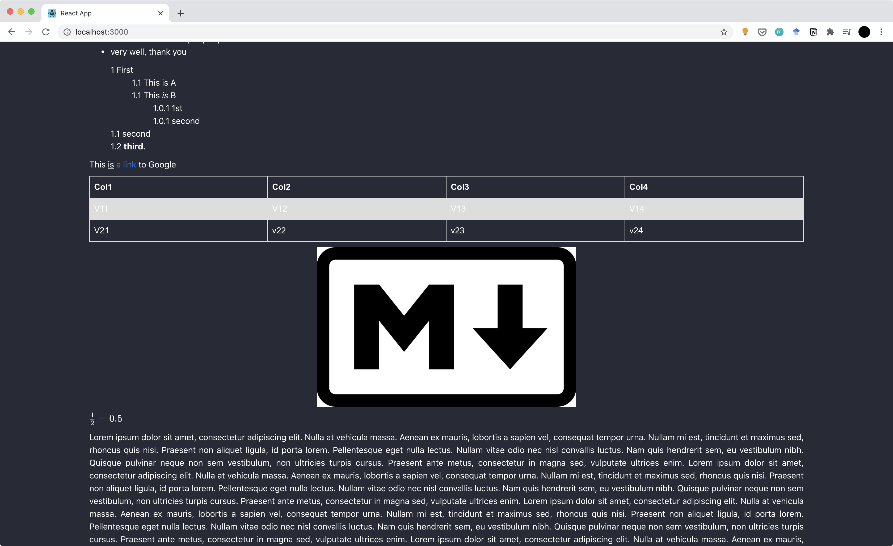

# Collaborative-Markdown-Editor

This project is work in progress.

The aim of this project is to offer a collaborative way of editing Markdown files inline.

The Markdown file is rendered on-the-fly, allowing for easier workflows for multiple users.

### Currently supported features
##### Editor
- Rich Text functionalities: bold, italic, hyperlinks, underscore & strikethrough
- Headers (5 levels)
- Nested ordered lists on 3 levels
- Nested unordered lists on 3 levels
- Tables
- Images
- Latex rendering

##### Front-end Application
- import/export of markdown files
- multi-user support by highlighting portions of the document that different users select with unique colors

### TODO
- Markdown document marhshalling/unmarshalling for synchronization between users
- Back-end that can handle multiple documents with multiple users separately, through different "rooms"
- More in-depth bug testing

### Known Issues
- While editing a selected zone (colored) the cursor behaves oddly and doesn't let you edit anything except for adding to the end
    + Users should not be able to edit the selections of other users